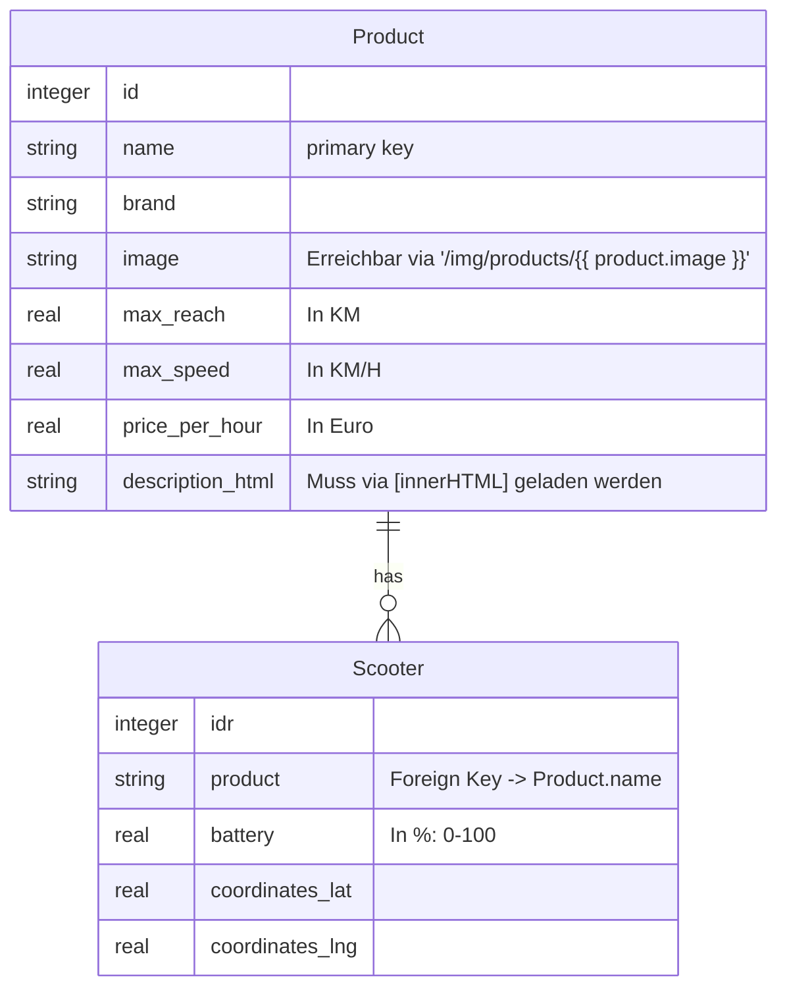

_Bitte auch das Video zu Docker beachten._

# Benutzung 

- **Hinweis:** Alle folgenden Befehle sollten in diesem Ordner ausgeführt werden. Bei älteren Versionen von Docker muss `docker-compose` statt `docker compose` verwendet werden.
- **Datenbank starten:** `docker compose up` (kann mittels CTRL+c wieder beendet werden)
- **Datenbank im Hintergrund starten:** `docker compose up -d`. Logs sind dann erreichbar durch
- **Datenbank-Instanz beenden / löschen:** `docker compose down`
- **Initiale Daten:** Die `init.sql` Datei bestimmt, welche Daten bei der Datenbank-Initialisierung geladen werden. Um die Datenbank neu mit Daten aus der `init.sql` zu befüllen, muss die Datenbank heruntergefahren werden (`docker compose down`), der `db_data` Ordner gelöscht werden, und die Datenbank wieder gestartet werden.
- Die Daten der Datenbank werden im `db_data` Ordner gespeichert. Dieser sollte nicht in Git(Lab) landen!

# Datenbank schema

# Infos zur DB

- Für die Bilder muss eventuell die Funktion [`encodeURIComponent`](https://developer.mozilla.org/en-US/docs/Web/JavaScript/Reference/Global_Objects/encodeURIComponent) verwendet werden.
- Die Bilder sind via URL `/img/products/<name>` erreichbar.
- Einheiten:
    - `Max_reach`: KM
    - `max_speed`: KM/H
    - `price_per_hour`: Euro
- HTML Beschreibungen (`description_html`) können mittels dem `[innerHTML]` Attribut in Angular geladen werden (z.B. `

`)
- Normalerweise würde man keine Relation mit dem `name` Attribut machen, sondern z.B. via internen Produktcode. Zur Vereinfachung des Software Projekts gehen wir einfach davon aus, dass jedes Scooter Produkt einen einzigartigen Namen hat

# Problembehebung

- [Tutorial zur Docker Installation](https://docs.docker.com/engine/install/)
- `Bind for 0.0.0.0:5432 failed: port is already allocated`: Bitte überprüfen sie ob schon eine Datenbank im Hintergrund läuft (z.B. von vorherigen Kursen) und beenden Sie diese, beispielsweise via `systemctl stop postgresql.service`. Falls dies nicht der Fall ist, können Sie (unter Linux) mit dem folgenden Befehl alle Anwendungen auflisten die auf Port 5432 laufen: `sudo ss -ltnp | grep ':5432' | awk -F'"' '{print $2}'`
